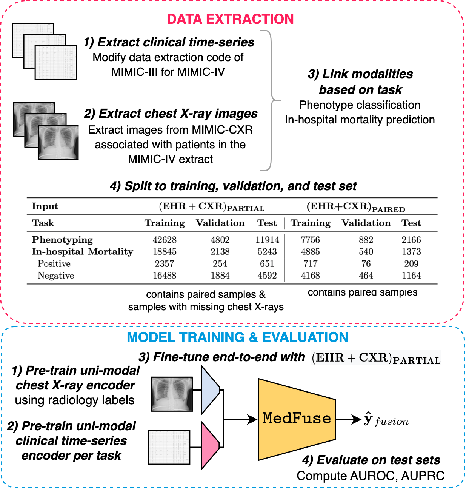
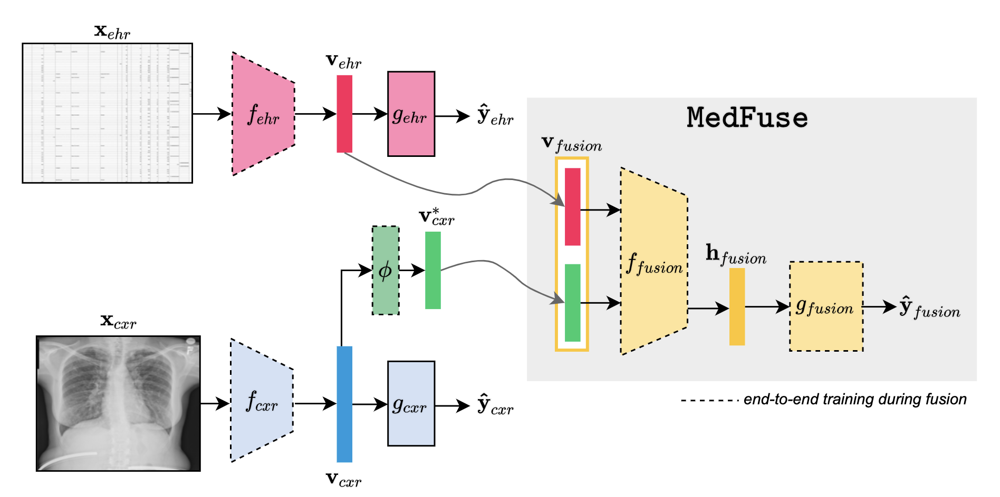

## Code for [MedFuse](https://arxiv.org/abs/2207.07027): Multi-modal fusion and benchmarking with clinical time-series and chest X-ray images


Table of contents
=================

<!--ts-->
  * [Background](#Background)
  * [Overview](#Overview)
  * [Environment setup](#Environment-setup)
  * [Dataset](#Dataset)
  * [Model training](#Model-training)
  * [Model evaluation](#Model-evaluation)
  * [Citation](#Citation)
   
<!--te-->

Background
============
Multi-modal fusion approaches aim to integrate information from different data sources. Unlike natural datasets, such as in audio-visual applications, where samples consist of “paired” modalities, data in healthcare is often collected asynchronously. Hence, requiring the presence of all modalities for a given sample is not realistic for clinical tasks and significantly limits the size of the dataset during training. In this paper, we propose MedFuse, a conceptually simple yet promising LSTM-based fusion module that can accommodate uni-modal as well as multi-modal input. We evaluate the fusion method and introduce new benchmark results for in-hospital mortality prediction and phenotype classification, using clinical time-series data in the MIMIC-IV dataset and corresponding chest X-ray images in MIMIC-CXR. Compared to more complex multi-modal fusion strategies, MedFuse provides a performance improvement by a large margin on the fully paired test set. It also remains robust across the partially paired test set containing samples with missing chest X-ray images.


Overview of the MedFuse network
====================================

We first extract and link the datasets from MIMIC-IV and MIMIC-CXR based on the task definition (i.e., inhospital mortality prediction,
or phenotype classification). The data splits of the training, validation, and test sets are summarized for each task, and the prevalence of positive and negative labels for in-hospital mortality is shown. Phenotype classification involves 25 labels as shown in Table 4.



Environment setup
==================

    git clone https://github.com/nyuad-cai/MedFuse.git
    cd MedFuse
    conda env create -f environment.yml
    conda activate medfuse

Dataset
-------------


We used [MIMIC-IV EHR](https://physionet.org/content/mimiciv/1.0/) and [MIMIC CXR](https://physionet.org/content/mimic-cxr-jpg/2.0.0/) for all the experiments. We provide the modified [script for MIMIC-IV](mimic4extract/README.md) originally developed for [MIMIC-III](https://github.com/YerevaNN/mimic3-benchmarks). Follow the [readme](mimic4extract/README.md) to extract and prepare the time-series EHR dataset for experiments. Download the [MIMIC CXR](https://physionet.org/content/mimic-cxr-jpg/2.0.0/) dataset.

Please specify the ehr_data_dir and cxr_data_dir directories paths before running the scripts.


We preprocess the cxr images and resize them to a relatively smaller dimension.
Please run following to resize the images

```
python resize.py
```

we exclude the subjects from training split of CXR dataset which are present in validation and test splits of EHR dataset, please run the following

```
python create_split.py
```

we use following multi-modal data configuration, "partial" defines the icu stays with clinical time series extracted from MIMIC-IV(ehr) samples and with or without a chest X-ray image(cxr). The "paired" are only the icu stays with both ehr as well as cxr samples. 

Argument "data_pairs" takes any of these options 'paired_ehr_cxr' samples both modalities(ehr+cxr) for paired icu stays, 'paired_ehr' samples only ehr for paired icu stays, 'partial_ehr' samples only ehr for partial icu stays, 'partial_ehr_cxr' samples both ehr and cxr for partial icu stays, and 'radiology' samples all of the MIMIC CXR samples with radiology labels 

Argument 'fusion_type' defines the fusion baselines and our proposed approach, options include 'daft', 'mmtm', 'joint', 'early', 'uni_ehr', 'uni_cxr'.

Please refer to arguments.py for further configurations.

Overview of the network with MedFuse module
====================================


Model training
-----------------

For MedFuse we pre-train the modality-specific encoders in stage one, run the following scripts.
```

# train the imaging model with 14 radiology labels.
sh ./scripts/radiology/uni_cxr.sh
# train LSTM model on extracted time-series EHR data for phenotype task.
sh ./scripts/phenotyping/train/uni_all.sh

# train LSTM model for in-hospital-mortality task
sh ./scripts/mortality/train/uni_all.sh
```

In stage two we fuse and fine-tune the single-modal represetations with our proposed MedFuse approach.
Set the best model paths of the 'load_state_cxr' and 'load_state_ehr' saved from stage one and run the following script.

```

# med fuse for in hospital mortality
sh ./scripts/mortality/train/medFuse.sh

# med fuse for phenotype task
sh ./scripts/phenotyping/train/medFuse.sh
```
We provide the training and evaluation scripts inside 'scripts' directory for other baselines as well for the results reported in the paper. 
Note these scripts contain the best Learning rates found from 10 random sampled learning rates in range (0.001-0.00001)

Model evaluation
------------------
Set the 'load_state' to the best model checkpoint path from above experiments before running the following scripts.
```
# med fuse for in hospital mortality
sh ./scripts/mortality/eval/medFuse.sh

# med fuse for phenotype task
sh ./scripts/phenotyping/eval/medFuse.sh
```


Updates
------------------
**March 2, 2023**: Note that we updated the repository to exclude chest X-rays collected after the first 48 hours of ICU stay in the in-hospital mortality task. This leads to the following numbers in this new setting: 4485 in the training set, 488 in the validation set, and 1242 in the test set. This requires retraining the models to obtain new results.

Citation 
============

If you use this code for your research, please consider citing:

```
@misc{https://doi.org/10.48550/arxiv.2207.07027,
  doi = {10.48550/ARXIV.2207.07027},
  url = {https://arxiv.org/abs/2207.07027},
  author = {Hayat, Nasir and Geras, Krzysztof J. and Shamout, Farah E.},
  title = {MedFuse: Multi-modal fusion with clinical time-series data and chest X-ray images},
  publisher = {arXiv},
  year = {2022},
  copyright = {Creative Commons Attribution 4.0 International}
}
```


